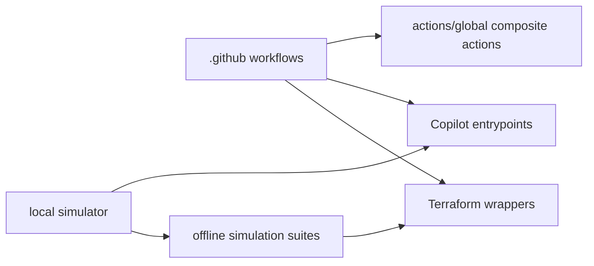

# Architecture

## 1. Purpose

`eng-cloud-strategy-hub` is a governance and enablement repository for Copilot customization, reusable GitHub Actions, cross-cloud Terraform wrappers, local workflow simulation, and offline validation. It has no single deployable application and does not own live cloud state.

## 2. System overview

The repository has three documented knowledge domains: Copilot customization, reusable automation, and Terraform operator tooling. The executable flow is driven by repository instructions and workflows, with local simulation and shell fixtures providing offline feedback.

The diagram describes current repository relationships, not a deployment topology. Live cloud resources, remote backends, and consumer application runtimes are outside this repository.

## 3. Current vs intended architecture

| Area | Current architecture | Intended architecture | Status | Evidence |
| --- | --- | --- | --- | --- |
| Repository role | Governance, reusable automation, operator wrappers, and validation are kept in one repository. | No separate intended shape is evidenced. | Documented | `README.md`, `AGENTS.local.md` |
| Provider wrappers | AWS, Azure, and GCP wrappers remain separate files with an aligned command contract. | Preserve separate provider adapters while keeping behavior aligned through simulations. | Documented | `scripts/*/terraform.sh`, `tests/scripts/terraform_wrappers/run.sh` |
| Knowledge layout | The context map and domain glossaries document three domains, while `AGENTS.local.md` still declares a single-context layout. | Use `CONTEXT-MAP.md` and one glossary per evidenced domain. | Documented | `AGENTS.local.md`, `docs/agents/domain.md`, `CONTEXT-MAP.md`, `docs/adr/0001-context-map.md` |

## 4. Technology stack

| Area | Technology | Status | Evidence |
| --- | --- | --- | --- |
| Workflow automation | GitHub Actions YAML and composite actions | Evidenced | `.github/workflows/`, `actions/global/*/action.yml` |
| Operator wrappers | Bash | Evidenced | `scripts/**/*.sh`, `validate-repo-locally.sh` |
| Local simulation | Python standard library with optional interactive dependencies | Evidenced | `tools/validate_repo_locally/validate_repo_locally.py`, `tools/validate_repo_locally/requirements.txt` |
| Infrastructure command surface | Terraform plus AWS CLI, Azure CLI, and gcloud | Evidenced | `scripts/aws/terraform.sh`, `scripts/azure/terraform.sh`, `scripts/gcp/terraform.sh` |
| Validation | pre-commit, actionlint, ShellCheck, pytest, and shell assertions | Evidenced | `.pre-commit-config.yaml`, `.github/workflows/`, `tests/` |

## 5. Repository map

| Path | Responsibility | Notes |
| --- | --- | --- |
| `AGENTS.md`, `AGENTS.local.md` | Repository operating policy | Read before structural changes. |
| `.github/` | Copilot instructions, workflows, templates, and validation scripts | Source-managed governance surface. |
| `actions/global/` | Reusable composite actions | Each action has its own `action.yml` and README. |
| `scripts/` | Provider wrappers and AWS state bootstrap script | Provider-specific files share a CLI shape. |
| `tools/validate_repo_locally/` | Local workflow simulator | Default execution is non-interactive and dependency-light. |
| `tests/` | Python tests and shell simulation suites | Fixtures use fake CLIs and synthetic state. |
| `docs/` | Architecture and agent-facing documentation | Domain map and ADRs are repository-wide. |
| `code/` | Reserved release package path | Contains release metadata and no implementation entrypoint. |
| `terraform/` | Reserved placeholder | Contains only `.gitkeep`; not an active delivery surface. |
| `tmp/` | Retained plans and disposable diagnostics | Not a shipped runtime or reusable API. |

## 6. Architectural boundaries

- `.github/` is the source for repository governance and workflow entrypoints; `actions/` is the source for reusable composite action implementations. Status: Evidenced. Evidence: `.github/`, `actions/global/`.
- `scripts/` owns provider wrapper behavior; `tests/scripts/` owns offline simulation and fixtures. Status: Evidenced. Evidence: `scripts/`, `tests/scripts/terraform_wrappers/`, `.github/workflows/terraform-sh-tests.yml`.
- `tools/validate_repo_locally/` coordinates selected local checks but does not replace GitHub-hosted workflows. Status: Evidenced. Evidence: `tools/validate_repo_locally/validate_repo_locally.py`, `validate-repo-locally.sh`.
- Live cloud state, remote Terraform backends, consumer applications, long-lived credentials, and provider governance data are outside the repository boundary. Status: Documented. Evidence: `README.md`, `scripts/README.md`.

## 7. Dependency rules

### Allowed direction

- Repository instructions and `.github/` workflow definitions may govern local validation and reusable action usage.
- Workflows and the local simulator may invoke scripts and test suites through their documented entrypoints.
- Tests may invoke wrappers through fake CLIs and synthetic fixtures.
- Provider wrappers may invoke Terraform and their provider CLI when the operator supplies the required execution context.

### Avoid / forbidden

- Do not make local simulation the source of truth for GitHub-hosted workflow behavior.
- Do not make wrapper tests depend on live cloud accounts or remote Terraform backends.
- Do not place live state, credentials, or consumer application runtime code in this repository.
- Do not introduce a shared Bash library merely to unify the three wrappers; their separate-file boundary is documented and tested.

## 8. Key flows

### Runtime flow

An operator invokes a Terraform wrapper with an action and an environment
argument or `noenv`. The wrapper resolves backend and variable-file inputs,
optionally performs provider CLI context checks, then invokes Terraform or
prints the commands when `--dry-run` is used. Evidence:
`scripts/aws/terraform.sh`, `scripts/azure/terraform.sh`,
`scripts/gcp/terraform.sh`.

### Build/test flow

`./validate-repo-locally.sh` delegates to the Python runner. The runner exposes workflow-mapped steps for actionlint, shell analysis, Copilot entrypoint smoke tests, pre-commit, Terraform wrapper simulations, and the AWS state creator suite. Evidence: `validate-repo-locally.sh`, `tools/validate_repo_locally/validate_repo_locally.py`.

### Deployment/operations flow

No repository-owned application deployment flow is evidenced. The AWS state creator is an operator bootstrap script, not a general deployment pipeline. Evidence: `scripts/aws/aws-terraform-s3-state-creator.sh`, `.github/workflows/terraform-sh-tests.yml`.

## 9. Configuration and environment

- Release configuration is split between `release-please-config.json` and `.release-please-manifest.json`, with package paths for the repository root, `scripts`, and `actions`.
- Workflow behavior is configured in `.github/workflows/` and `.pre-commit-config.yaml`.
- The local simulator accepts `--root`, `--only`, `--skip`, `--interactive`, `--fail-fast`, `--dry-run`, and `--tmp-dir`; the root launcher forwards these options.
- Wrapper configuration is discovered from provider-specific environment or project directories, optional `--tfvars` overrides, and provider environment variables such as `TF_STATE_PROJECT_ID` in the GCP wrapper.
- Defaults and input validation are owned by the relevant `action.yml` or script. No secret values are documented here.

## 10. Testing and validation

| Change type | Suggested validation | Evidence |
| --- | --- | --- |
| Workflow or composite action | `./validate-repo-locally.sh --only actionlint`, plus the relevant action smoke or consumer check | `.github/workflows/_code-analysis.yml`, `tools/validate_repo_locally/validate_repo_locally.py` |
| Bash wrapper or shell fixture | `bash -n`, `shellcheck`, and `make terraform-wrapper-tests` or `make aws-s3-state-creator-tests` | `.github/workflows/terraform-sh-tests.yml`, `Makefile` |
| Python runner or action helper | `python3 -m pytest -q tests/` and the relevant local simulator step | `tests/`, `tools/validate_repo_locally/` |
| YAML, JSON, Terraform, or broad repository change | `pre-commit run --all-files --config .pre-commit-config.yaml` when the pinned container or local toolchain is available | `.pre-commit-config.yaml`, `.github/workflows/_pre-commit.yml` |

The workflow and local checks may require tools such as actionlint, ShellCheck, Docker, Terraform, or provider CLIs. When a dependency is unavailable, report that check as not run rather than treating another check as equivalent coverage.

## 11. Architectural decisions visible in the repo

| Decision | Status | Evidence | Trade-off | Related ADR |
| --- | --- | --- | --- | --- |
| Keep provider wrappers as separate files with an aligned CLI contract. | Documented | `scripts/aws/terraform.sh`, `scripts/azure/terraform.sh`, `scripts/gcp/terraform.sh`, `tests/scripts/terraform_wrappers/run.sh` | Duplicates some shell logic but keeps provider-specific behavior explicit. | None |
| Use a context map for the three evidenced knowledge domains. | Accepted | `CONTEXT-MAP.md`, `docs/agents/domain.md` | Adds navigation files, but avoids forcing unrelated vocabulary into one glossary. | `docs/adr/0001-context-map.md` |

## 12. AI-agent working rules

- Read this document and the applicable `AGENTS.md` files before structural changes.
- Prefer existing repository patterns over new abstractions.
- Do not introduce new frameworks or cross-cutting refactors without explicit approval.
- Preserve existing patterns, boundaries, generated blocks, and user changes.
- Keep changes scoped to the owning component and update this document when an intentional architectural boundary changes.
- Report conflicts between declarations and on-disk evidence before editing.

## 13. Last verified

- Verification date: 2026-09-01.
- Agent or tool: GitHub Copilot using the `internal-knowledge` bootstrap workflow.
- Files inspected: repository instructions, root README, existing architecture, `.github/`, `actions/global/`, `scripts/`, `tools/validate_repo_locally/`, `tests/`, release configuration, and validation workflows.
- Commands considered: `bash -n`, ShellCheck, actionlint, pre-commit, pytest, the Makefile suites, and `./validate-repo-locally.sh`.
- Confidence: high for repository structure and local validation ownership; unknown for live cloud behavior because no live execution was attempted.

## 14. Unknown / To verify

- `AGENTS.local.md` still declares a single-context layout while the accepted
  ADR, context map, and agent-facing domain guide declare a multi-context
  layout. Repository policy is outside this documentation workflow's write
  boundary and requires a separately authorized alignment.
- Whether every consumer repository uses the same reusable action version and permission model is not evidenced locally.
- Whether the AWS state creator has an operational owner outside this repository is not evidenced.
- The intended future contents of the reserved `code/` and `terraform/` roots are unknown.
- No repository-owned application deployment architecture is evidenced.
